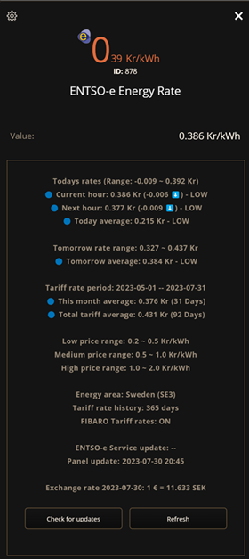

# Energy Spot Price

The <b>ENTSO-e Energy Rate</b> QuickApp give you the current and coming energy spot price rates by hour from <a href="https://transparency.entsoe.eu/">ENTSO-e transparency platform</a> in your local currency. ENTSO-e is independent from any power company and no subscription or specific hardware is required to get this to work.

<i>If you pay your energy consumption by hour then this QA can save you money!</i>

This QA has spot prices for the following countries: <b>Austria, Belgium, Bosnia and Herz., Bulgaria, Croatia, Czech Republic, Denmark, Estonia, Finland, France, Germany, Greece, Hungary, Ireland, Italy, Latvia, Lithuania, Luxembourg, Netherlands, North Macedonia, Norway, Poland, Portugal, Romania, Serbia, Slovakia, Slovenia, Spain, Sweden, Switzerland, Ukraine </b>and<b> United Kingdom.</b>




<b>How it works</b>

After you have download, you need to unzip the file to get the <b>.fqa</b> file to install in FIBARO and I also provide the icon in <b>.png</b> format.

After you have add this QA in FIBARO devices, you have some new general variables where you select your energy area that you belong to in <b>[EnergyArea]</b> and what your medium price rate is in <b>[EnergyMediumPrice]</b>. Thats all needed!


The variation of energy hour level in <b>[EnergyHourLevel]</b> is calculated from the medium price that you have define in the global variable <b>[EnergyMediumPrice]</b>. You set the medium price from what you feel is the medium price for you in your currency by consumed kWh.
<i>(The currency exchange rate is collected from <a href="exhangerate.host">exhangerate.host</a> service in this QuickApp.)</i>

The global variable <b>[EnergyNextHourLevel]</b> indicate what price level it will be the next hour, and <b>[EnergyMonthLevel]</b> indicate what the avrage price is in current month.

You can then easy trigger scenes or devices based on the value in the global variables <b>[EnergyHourLevel], [EnergyNextHourLevel]</b> or <b>[EnergyMonthLevel]</b> that can have the following values:

- VeryLOW
- LOW
- MEDIUM
- HIGH
- VeryHIGH

Usage in Lua scen:
```lua
local value = hub.getGlobalVariable("EnergyHourLevel")
if (value == "VeryHIGH") then
...
end
```

Or in Block scen:


The <b>ENTSO-e Energy Rate</b> QuickApp also store spot prices in the FIBARO Energy Tariff table.
You set how many days to store history in FIBARO tariff table in the QA variable <b>[TariffHistory]</b>.


```lua
-- How to get FIBARO Energy Tariff data
local tariffData = api.get("/energy/billing/tariff")
local currentRate = tariffData.rate
local tariffTable = tariffData.additionalTariffs
...

-- How to get Global QA Tariff state data
local tariffTable = {}
local jsonString = fibaro.getGlobalVariable("EnergyStateTable")
-- Decode json string to Lua table
if (jsonString ~= nil and jsonString ~= "") then 
    tariffTable = json.decode(jsonString)
end
...

```
