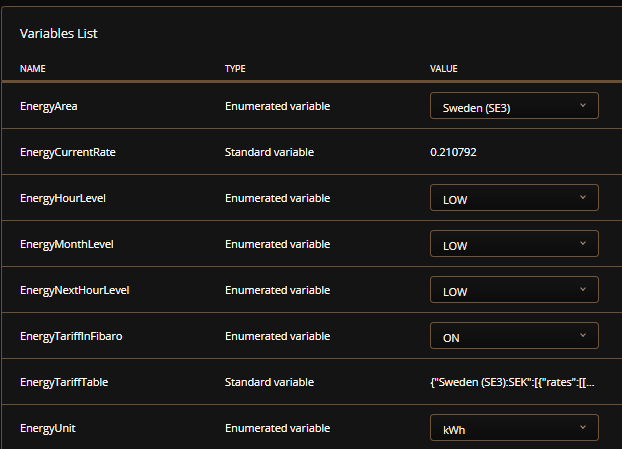

# Energy Spot Price

The <b>ENTSO-e Energy Rate</b> QuickApp give you the current and coming energy spot price rates by hour from <a href="https://transparency.entsoe.eu/">ENTSO-e transparency platform</a> in your local currency. ENTSO-e is independent from any power company and no subscription or specific hardware is required to get this to work.
<i><h5>(*Local currency now reqires a free account at https://exchangerate.host)</h5></i>

<br>

:bulb: <i>If you pay your energy consumption by hour then this QA can save you money!</i>

<br>

This QA has spot prices for the following countries: <b>Austria, Belgium, Bosnia and Herz., Bulgaria, Croatia, Czech Republic, Denmark, Estonia, Finland, France, Germany, Greece, Hungary, Ireland, Italy, Latvia, Lithuania, Luxembourg, Netherlands, North Macedonia, Norway, Poland, Portugal, Romania, Serbia, Slovakia, Slovenia, Spain, Sweden, Switzerland, Ukraine </b>and<b> United Kingdom.</b>


<b><h1>How to install</h1></b>
After you have download, you need to unzip the file to get the <b>.fqa</b> file that can be install in FIBARO, I also provide the icon in <b>.png</b> format.

1. Click "+ Add device"
1. Choose Other Device
1. Choose Upload File
1. Select unzipped .fqa file

<b><h1>How it works</h1></b>

After you have add this QA in FIBARO devices, you need to set your local energy area that you belong to in the general variables <b>[EnergyArea]</b> to start collecting energy prices.



The variation of energy hour level in <b>[EnergyHourLevel]</b> is calculated from price values you set in the QA local variables <b>[PriceLow], [PriceMedium], [PriceHigh], [PriceVeryHigh]</b>. You set those prices from what you feel is the correct level prices for you in your local currency* by consumed kWh.

<h4>(*If you use other than € Euro as your local currency, you need to get your own free "API access key". See "Exchange rate in local currency" below for more information.)</h4>

<br>

Global variables to use in scenes:

<b>[EnergyCurrentRate]</b> show current energy rate price in selected currency. </br>
<b>[EnergyHourLevel]</b> show what price level it is current hour. </br>
<b>[EnergyNextHourLevel]</b> show what price level it will be the next hour. </br>
<b>[EnergyMonthLevel]</b> show what the avrage price is in current month. </br>

To calculate different energy prices including tax, costs, grid, fee, etc, you change these values in the local QA variables.
<h4>(EnergyRate * ExchangeRate + OperatorCost * Losses * Adjustment + DealerCost + GridCost * Tax)</h4>


<b><h1>Trigger scenes</h1></b>

You can then easy trigger scenes or devices based on the value in the general variables <b>[EnergyHourLevel], [EnergyNextHourLevel]</b> or <b>[EnergyMonthLevel]</b> that can have the following values:

- :red_circle: VeryHIGH
- :orange_circle: HIGH
- :yellow_circle: MEDIUM
- :large_blue_circle: LOW
- :green_circle: VeryLOW
- :purple_circle: Negative <i>(Only available if <b>[NegativeRates]</b> = ON)</i>

Usage in Lua scen:
```lua
    local value = hub.getGlobalVariable("EnergyHourLevel")
    if (value == "VeryHIGH") then
        ...
    end
```

Or in Block scen:


<b><h1>FIBARO Tariff rates</h1></b>

You can turn ON/Off storage of <b>ENTSO-e Energy Rates</b> in the FIBARO Energy Tariff table with the general variable <b>[EnergyTariffInFibaro]</b>, and you set how many days to store history in FIBARO tariff table in the QA variable <b>[TariffHistory]</b>.
<i>In FIBARO Tariff settings you also set your local currency to use in this QA.</i>


<b><h1>Lua code samples</h1></b>

```lua
    -- How to get FIBARO Energy Tariff data
    local tariffData = api.get("/energy/billing/tariff")
    local currentRate = tariffData.rate
    local tariffTable = tariffData.additionalTariffs
    ...

    -- How to get General variable QA Tariff state table decoded in a Lua table
    local jsonString = fibaro.getGlobalVariable("EnergyTariffTable")
    local tariffTable = json.decode(jsonString)
    ...
 
    -- How to get current energy rate price
    local currentRate = fibaro.getGlobalVariable("EnergyCurrentRate")
    ...

```

<b><h1>ENTSO-e Token</h1></b>

You can get your own ENTSO-e token if needed and replace the existing token in the local QA variable <b>[ENTSOE_Token]</b>, but this is not reqired to get the QA to work.

:bulb: <i>How to request for your own token at ENTSO-e site: <a href="https://transparency.entsoe.eu/content/static_content/Static%20content/web%20api/Guide.html#_authentication_and_authorisation">ENTSO-e Restful API access</a></i>

<b><h1>Exchange rate in local currency</h1></b>

If you use other currency than the default Euro € in FIBARO Tariff settings, then you need to register a free account at https://exchangerate.host/signup/free to get a "API Access Key", that is required in the local QA variable <b>[ExchAccessKey]</b> to get your local currency rates.

<b><h1>Feedback</h1></b>

I would love if you gave me some feedback on whether or not you like this QA, maybe I missed some function you need, let me know... Or just give your Rating on the QuickApp:

https://marketplace.fibaro.com/items/entso-e-energy-rate
